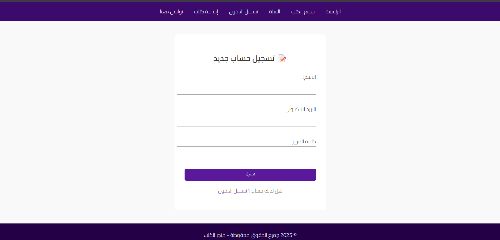

 # 📚 Book Store Website

A PHP-based online bookstore web application that allows users to browse books, view details, add items to the cart, and complete checkout.  
The project also includes basic admin functionality for managing books.

---

## 🖼️ Screenshots

### 🏠 Home Page


### 🔐 Login Page


### 📝 Register Page


### 📘 Book Details


### 🛒 Shopping Cart


### 📂 Main Page


> 📌 **Note:** File names are case-sensitive on GitHub and Linux servers.

📘 GitHub Markdown Images Reference:  
https://docs.github.com/en/get-started/writing-on-github/working-with-advanced-formatting#adding-images

---

## 📂 Project Structure

```text
Book_store_website/
│── Add_book.php        # Admin page to add new books
│── book-details.php    # Book details page
│── Book.php            # Book model / logic
│── cart.php            # Shopping cart
│── checkout.php        # Checkout process
│── index.php           # Homepage
│── login.php           # User login
│── Screenshot/          # Application screenshots
│── .git/               # Git version control files
```
Requirements

PHP 7.4 or higher

Apache or Nginx web server

MySQL database

Web browser with JavaScript enabled

📘 PHP Requirements:
https://www.php.net/supported-versions.php

🚀 Installation and Setup
1️⃣ Clone the repository
git clone https://github.com/salehff21/Book_store_website.git


Or manually upload the project to:

/var/www/html/Book_store_website


📘 Git Clone Reference:
https://docs.github.com/en/repositories/creating-and-managing-repositories/cloning-a-repository

2️⃣ Configure the Database

Create a MySQL database (e.g. bookstore)

Import the SQL schema (if available)

Update database connection details in your PHP config file
(create one if missing)

Example connection file:

<?php
$servername = "localhost";
$username   = "root";
$password   = "";
$dbname     = "bookstore";

$conn = mysqli_connect($servername, $username, $password, $dbname);

if (!$conn) {
    die("Connection failed: " . mysqli_connect_error());
}
?>


📘 MySQL + PHP (mysqli):
https://www.php.net/manual/en/book.mysqli.php

3️⃣ Run the Project

Start Apache server

Open in browser:

http://localhost/Book_store_website

🔑 Features

User authentication (Login & Register)

Browse books and view details

Add books to shopping cart

Checkout system

Admin page for adding new books

📌 Notes

Ensure correct file permissions for PHP execution

Sanitize inputs and use prepared statements for security

Enable HTTPS before production deployment

❌ GitHub Pages does not support PHP — use a PHP-enabled server

📘 GitHub Pages Limitations:
https://docs.github.com/en/pages/getting-started-with-github-pages/about-github-pages

👨‍💻 Contributor

Eng: Saleh Al-shaebi
